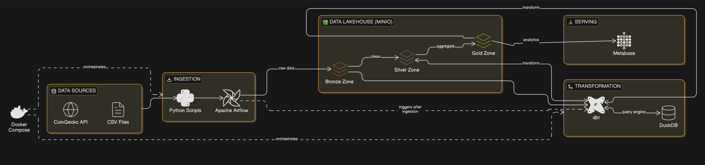

# Lakehouse Analytics Platform

End-to-end crypto market data pipeline: ingest **CoinGecko** + **yfinance** (optional **Kaggle CSV** backup) into **MinIO** as Bronze Parquet, orchestrate with **Apache Airflow**, transform with **dbt + DuckDB** (Silver → Gold), and explore in **Metabase**.

## Architecture



## Tech stack

| Layer          | Tool                                      |
| -------------- | ----------------------------------------- |
| Ingestion      | Python, Requests, yfinance, boto3, Parquet  |
| Orchestration  | Apache Airflow (Docker, LocalExecutor)    |
| Storage        | MinIO (S3-compatible)                     |
| Transformation | dbt + DuckDB                              |
| Dashboard      | Metabase                                  |
| Infrastructure | Docker Compose                            |

## Project layout

```
lakehouse-analytics/
├── ingestion/
│   ├── fetch_market_data.py      # Bronze → MinIO (Parquet)
│   └── data/                     # Optional backup.csv (Kaggle-style)
├── dbt/
│   ├── models/
│   │   ├── staging/              # Silver: typed, cleaned
│   │   ├── intermediate/       # Joins / daily grain
│   │   └── marts/                # Gold: marts
│   ├── macros/
│   ├── seeds/
│   └── dbt_project.yml
├── orchestration/
│   └── dags/
│       └── market_pipeline.py    # Daily: ingest → dbt run
├── dashboard/
│   └── screenshots/
├── docker/
│   ├── airflow/                  # Airflow image + pip deps
│   └── dbt/                      # Standalone dbt image (optional)
├── scripts/
│   └── dbt                       # Wrapper: local dbt without ~/.dbt
├── docker-compose.yml
├── requirements.txt
└── README.md
```


